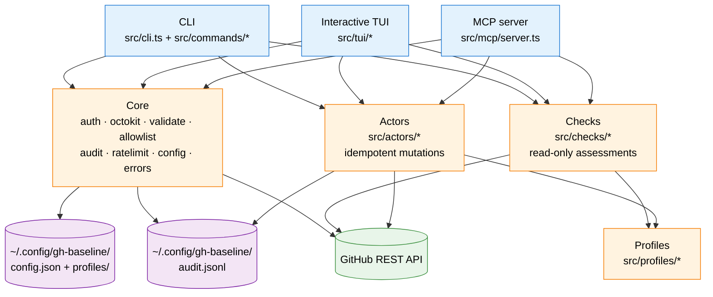
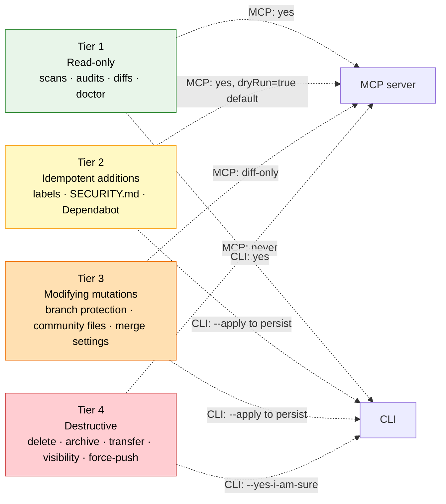
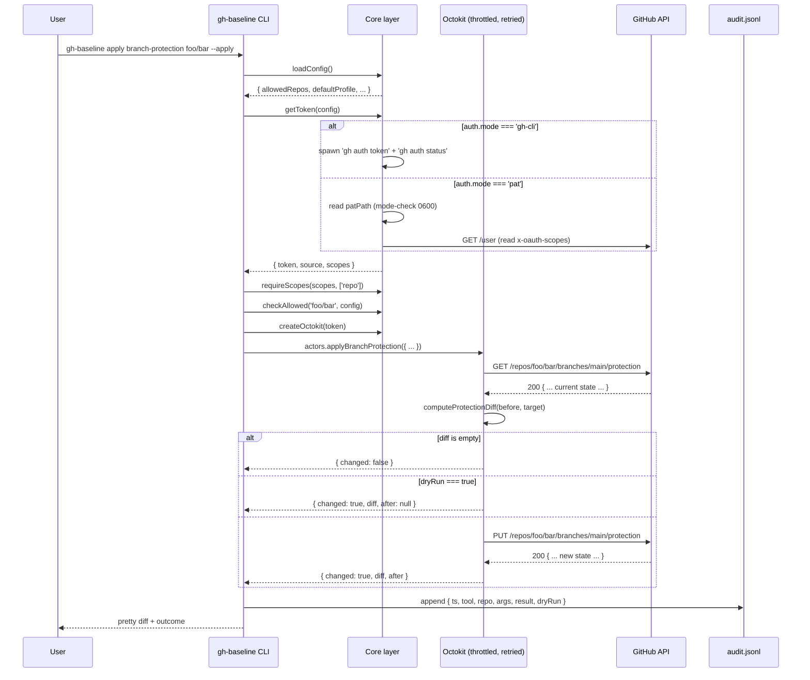
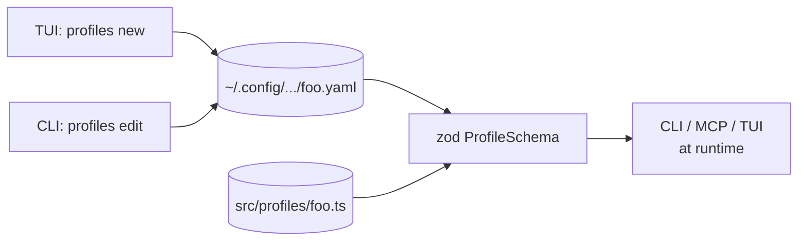

# Architecture

`gh-baseline` runs as one of three surfaces sharing a single core. This document captures how they fit together and why.

## Three surfaces, one core

The CLI is for cron and scripting. The TUI is for human composition. The MCP is for Claude Code. They all agree on the same core, the same profiles, and the same audit log.

## The four security tiers

The classification isn't bureaucratic — it determines what the MCP server is allowed to expose. An LLM with `gh-baseline` access cannot reach a Tier 4 operation no matter what it's told.

## Token + request flow

The shape is consistent across all actors:

1. Load config, resolve token, check scopes, check allowlist, build octokit.
2. Read current state.
3. Compute diff against profile/target.
4. If empty → no-op (and that's still audit-logged as `result: 'ok'`).
5. If `dryRun` → return the diff without persisting.
6. Else → persist via PUT/PATCH/POST.
7. Append to audit log regardless.

## Profiles: programmatic vs declarative

A profile is the target state of a repo. Two ways to author one:

- **Programmatic** — a TypeScript module under `src/profiles/<id>.ts` exporting a `Profile` object. Bundled with the package, version-controlled in this repo. Used for company defaults and the curated `oss-public` standard.
- **Declarative** — a YAML file under `~/.config/gh-baseline/profiles/<id>.yaml`. Composed via the interactive TUI builder or hand-written. User-specific.

Both validate against the same `ProfileSchema` (zod) at load time. The CLI and the MCP behave identically with either.

Why both? TypeScript modules let bundled profiles use full language features (re-export shared label sets, compose). YAML is the right format for user-authored, version-controllable, shareable profiles.

## Why the safeguards are non-negotiable

Each safeguard exists because a different failure mode is otherwise plausible:

- **Allowlist**: an LLM compromise (or a fat-finger) shouldn't be able to touch arbitrary repos by passing different slugs. Default deny.
- **Dry-run by default**: every diff is shown before any write. The user opts in.
- **Audit log**: when something goes wrong, the answer to "what did it do?" must be on disk.
- **PR-not-push**: file changes that go through PR cooperate with the target repo's branch protection rather than bypass it. Direct writes to `main` would be a contradiction of `gh-baseline`'s purpose.
- **Idempotency**: re-running the same `apply` against the same repo must be a no-op. Otherwise drift detection breaks.
- **Scope inspection**: starting up with the wrong scopes is a hard fail, not a silent failure deep inside an operation.
- **Rate limiting**: an LLM that spirals shouldn't be able to spray 1000 API calls.

Drop any one of these and `gh-baseline` becomes "Octokit with chat-friendly wrappers". Keep them all and it's a tool you can hand the keys to without losing sleep.
